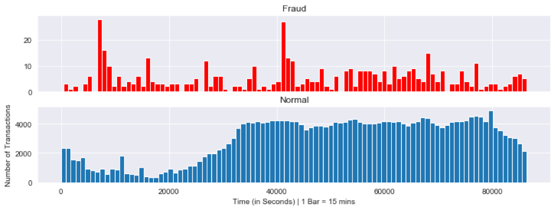
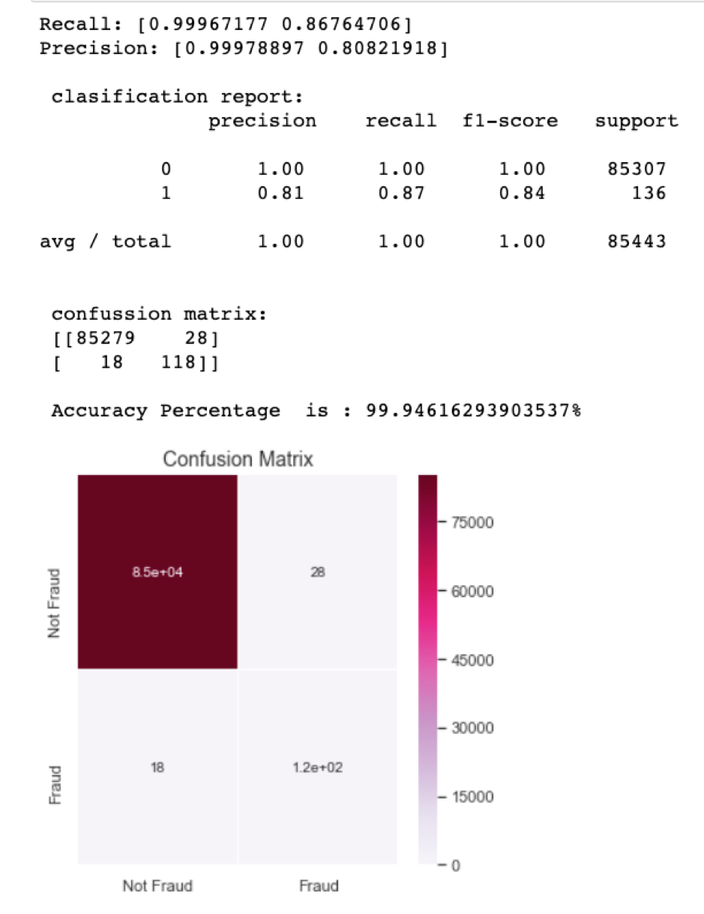
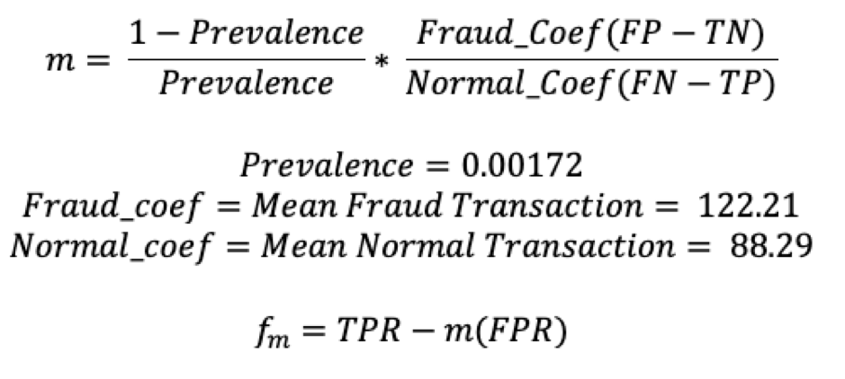
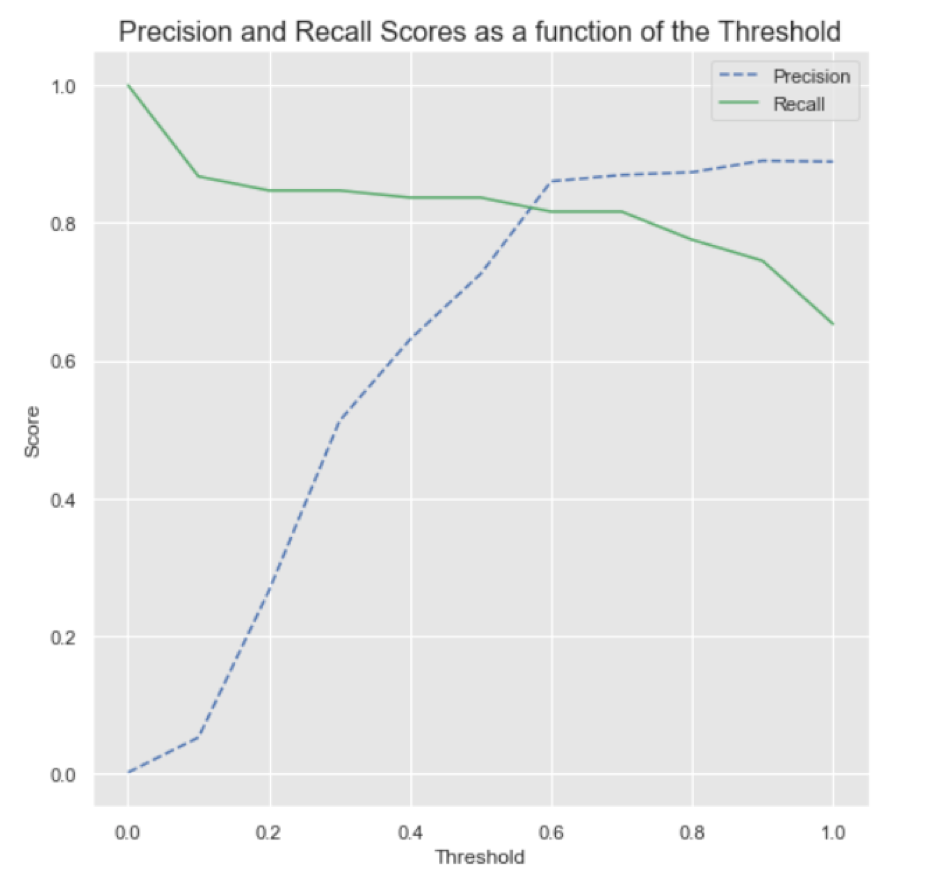
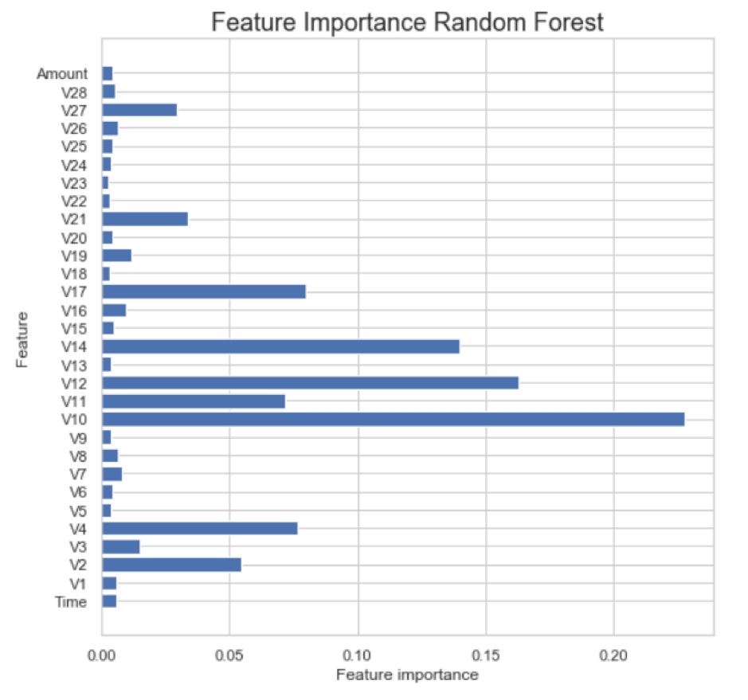

# Credit Card Fraud Detection - Mod05_Project

Context
Objectives
Methodology
Sampling
Models
Final model threshold selection
Evaluation
Final Model Test Set Results
Conclusion & Recomendations

## Context
The datasets contain transactions made by credit cards in September 2013 by European cardholders. This dataset presents transactions that occurred in two days, where we have 492 frauds out of 284,807 transactions. The dataset is highly unbalanced, the positive class (frauds) account for 0.172% of all transactions.
It contains only numerical input variables which are the result of a PCA transformation. Unfortunately, due to confidentiality issues, we were not provided with the original features and more background information about the data. Features V1, V2, ... V28 are the principal components obtained with PCA, the only features which have not been transformed with PCA are 'Time' and 'Amount'.

<b>Time of Transaction</b>
The feature `Time` contains the seconds elapsed between each transaction and the first transaction in the dataset Over the 2 days. This was adjusted to a daily cycle, there being 86400 seconds in a day,  so the distribution of the transactions over time could be observed.

The figure above shows the distribution of transactions mostly occur between 8 am (28800 sec) and 11 pm (82800 sec) and at a relatively constant rate of 4000 transactions every 15 mins.  

<b>Amount of Transaction</b>
The feature `Amount` is the transaction Amount, this feature can be used for example-dependant cost-sensitive learning.
*** Amount vs Time graph ***
The `Class` feature is the target variable and it takes value 1 in case of fraud and 0 otherwise.

## Objectives

It is important that credit card companies are able to recognize fraudulent credit card transactions so that customers are not charged for transactions that they did not conduct. The ideal credit card fraud detection algorithm would be to detect 100% of fraudulent transactions, whilst minimising the number of falsely flagged non-fraudulent transactions.

### Objective Criteria:   

Therefore the model selection has a priority rank of;

1) Correctly identify as many fraudulent transactions as possible.

    a) Minimising the type II error, False Negatives (fraudulent transactions that were flagged as non-fraudulent transactions)

    b) Ideally, the type II error would be zero. However, due to the Precision-Recall trade-off, the number of false positives (type I errors) will increase as we reduce the number of False Negatives.

2) Have an acceptable False Positive Rate.

    a) Minimise the type I error, False Positive. (non-fraudulent transactions that were flagged as fraudulent transactions)

    b) We do not want an excessive amount of non-fraudulent transactions being flagged as fraudulent. Firstly, as customers will get annoyed if too many transactions are being questioned, remembering this is still not as bad as then being stolen from, but still a priority.

3) Having a manageable number of fraud cases to deal with per day.
    a) For the wider business case,  having a  manageable number of case of fraudulent transaction to follow up on. Balancing the losses to the customer in refunds to the cost of highering more staff to deal with the larger flagged fraudulent cases.  

The cost functions for chosing the threshold for the models will be based around the assumed cost of either reimbusing a a customer with money that was stolen or the cost of chasing/blocking non-fraudulent transactions. Along with the total number of flagged fraudulant cases the bank can deal with per day.

## Methodology

### Imbalanced Classes:

An assumption of classification models is that all the classes are of equal occurrence in the data set. In our case of a binary classification problem, the split is 50/50. We also wish to use a form of oversampling, as the number of fraudulent case (the minority class) is only 0.172% of all of the transactions.

There are several options for dealing with imbalanced classes, the most common being Synthetic Minority Over-sampling Technique (SMOTE). Which we will be using in this project.

Another technic is adaptive synthetic sampling approach (ADASYN). This is shifts the importance of the classification boundary to those minority classes which are most difficult to classify. So would be an option for further investigation.

Note that an undersampled test set was used with an SVM model as the training for the SVM on the total sample test would have taken too long for the project to be completed.

### Models:

For each of the models the Grid-Search with Cross Validation (GS-CV) iterative technic was used. This is where the model is run several times with an ever diminishing range, until the optimum combination of hyperparameters is found.  

<b> List of Models Investigated:</b>
* Logistic Regression
* K Nearest Neighbours
* Support Vector Machine
* XGBoost
* Random Forest

## Conclusion

### Final Model:

A Randon Forest was chose as the final model. The resuslts below are from the non-threshold adjusted results.

### Threshold Selection

Prevalence = 0.00172
Fraud coef = 122.21 (Mean Amount Fraud Transaction)
normal coef = 88.29 (Mean Amount Non-Fraud Transaction)

Using the calculations above, we chose the threshold that gives the highest f_m. The complete range of the thresholds compared to the presions & recall scores are below. This has a good ilistration of the

This shows a good illustration of the trade-off between the precision and recall. For a decrease in the number of False Negatives, Frauds that were not flagged by the model, there will be an increase in the number of False Positives. Incorrectly flagged non-fraudulent transactions.

Also, from the precision-recall curve, the fact that the recall does not drop to zero, is why “total recall” cannot be achieved. The Random Forest is unable to identify all of the fraudulent cases with the predictors given. This is a case for investigate other models further that potentially achieve better results, such as the SVM’s.

The threshold selected was 0.9, which gave the results below:

### Features Importance

V10, V12 & V14 are the most important featurs for the final model of a random forest. These are the features that the customer should monitor more tightly as they are the promanat features in fraudulent cases.
